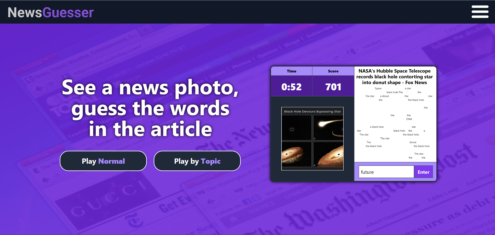
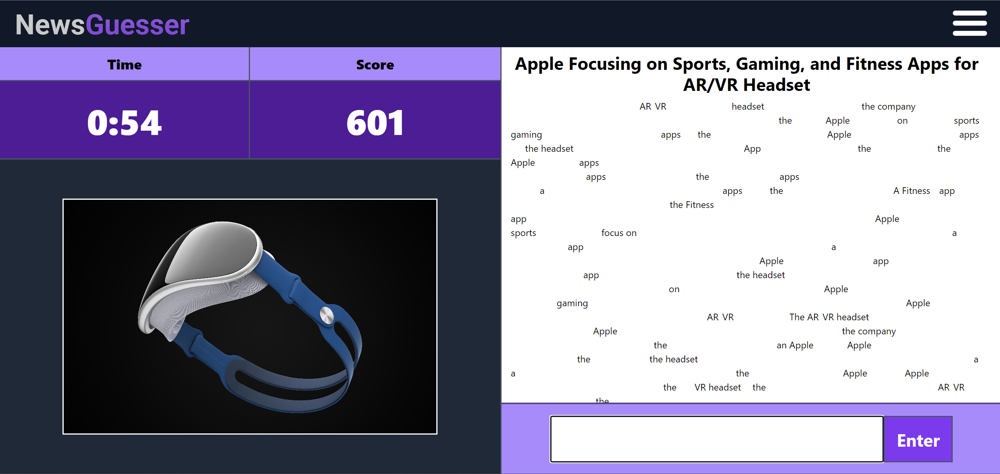

# NewsGuesser

[Live Demo](https://drive.google.com/file/d/12MqS4YXL6hBH59ZvPJJDdxUdV7nwTFow/view)&nbsp;&nbsp;|&nbsp;&nbsp;<i>Created: Fall 2022 (College Freshman)</i>

<b>NewsGuesser is a web game in which users have 2 minutes to guess as many words in a news article as possible from seeing only its picture and title.</b> 
  
The longer the word and the more times it appears in the article, the more points you receive. 
Users can play normal mode (pulls random news articles) or topics mode (pulls news articles based on a topic the user selects).

The server pulls news article data from NewsAPI, then the client-side parses the data to use for the game. 

  <b>Tools used:</b>
 - JavaScript - React, Node, Express
 - HTML/CSS - Tailwind, Sass
 - Axios, Readability
